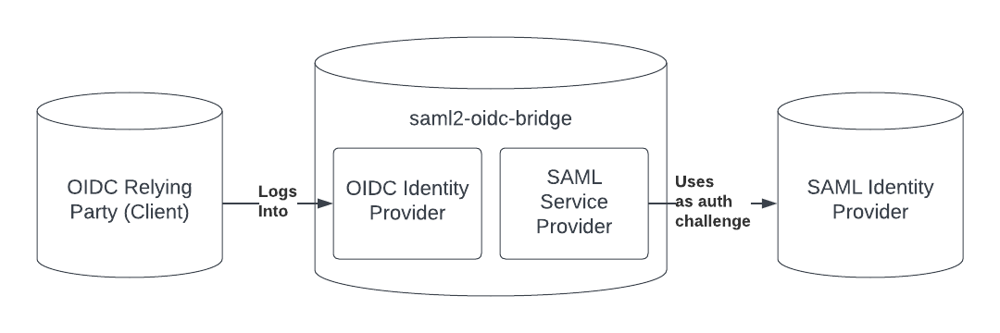

# saml2-oidc-bridge

A server the allows OIDC applications to work with SAML identity providers.



## Setup

See the [setup tutorial](./tutorial.md) for a more in-depth description of setting up the server.

### Step 1: Download the library

```bash
npm install -g saml2-oidc-bridge
```

### Step 2: Proxy Configuration

If you plan to deploy with nginx, follow the configuration listed below. This guide does not detail setting up SSL, but it is suggested to do so as most SAML providers will not work without SSL.

```
proxy_set_header Host $host;
proxy_set_header X-Real-IP $remote_addr;
proxy_set_header X-Forwarded-For $proxy_add_x_forwarded_for;
proxy_set_header X-Forwarded-Proto $scheme;
proxy_pass http://127.0.0.1:3000;
proxy_redirect off;
```

### Step 3: Generate Keys

Four keys must be generated for this project. They can all be saved to separate files. This solution uses OpenSSL, so be sure that is installed first.

#### SAML Client Public and Private Key
```
openssl req -newkey rsa:2048 -new -nodes -x509 -days 3650 -keyout saml-client-key.pem -out saml-client-cert.pem
```

This should generate two files. `saml-client-key.pem` (the private key) and `saml-client-cert.pem` (the public key).


#### SAML IDP Public Keys

Each SAML IDP must have a public key. To find the public key for a particular SAML IDP, look for the `<ds:X509Certificate>` tag. We'll call this file `saml-idp-key.crt`.

#### OIDC JWKS

JSON Web Key Sets can be [here](https://mkjwk.org/). Once you generate the key, select the center value labeled "Public and Private Keypair Set". We'll call this file `oidc-jwks.json`

### Step 4: Deploy Redis

Deploy a redis server that is accessible from your machine.

### Step 5: Configuration

Create a json file and fill it with a configuration like the one below. We'll call it `config.json`.

```json
{
  "baseUrl": "https://saml2-oidc-bridge.com",
  "port": "3000",
  "saml": {
    "privateKey": "./saml-client-key.pem",
    "cert": "./saml-client-cert.pem",
    "idps": [
      {
        "name": "example-saml-idp",
        "displayName": "Example SAML IDP",
        "sso_login_url": "https://example-saml-idp.com/login",
        "sso_logout_url": "https://example-saml-idp.com/logout",
        "certificates": "saml-idp-key.crt"
      },
    ]
  },
  "oidc": {
    "clients": [
      {
        "client_id": "some-client-id",
        "client_secret": "client-secret",
        "redirect_uris": [
          "https://oidcdebugger.com/debug"
        ],
        "allowedOrigins": [
          "https://oidcdebugger.com"
        ],
        "token_endpoint_auth_method": "none"
      }
    ],
    "cookieKeys": ["secret", "keys"],
    "jwks": "./oidc-jwks.json"
  },
  "redis": {
    "port": 6379,
    "host": "127.0.0.1",
    "prefix": "oidc:"
  }
}
```

 - `baseUrl`: The URL you will deploy the bridge at
 - `port`: The port the server should listen at
 - `saml`: SAML configurations. The saml2-oidc-bridge is treated as a SAML client for IDPs
    - `saml.privateKey`: The private key generated in the previous step
    - `saml.cert`: The cert (public key) generated in the previous step
    - `idps`: A list of SAML IDPs this bridge should serve
       - `saml.idps[*].name`: A url-safe name for the idp. This will eventually be used to tell the saml2-oidc-bridge which idp it should try to login to.
       - `saml.idps[*].displayName`: A plain english name for the IDP. This will be used in a UI that lets the user select the IDP they want to login to.
       - `saml.idps[*].sso_login_url`: The login URL for the IDP. This can be found in the IDP metadata in the `location` field for the `SingleSignOnService` tag with a binding of `urn:oasis:names:tc:SAML:2.0:bindings:HTTP-Redirect`. (`<SingleSignOnService Binding="urn:oasis:names:tc:SAML:2.0:bindings:HTTP-Redirect" Location="https://example-saml-idp.com/login" />`)
       - `saml.idps[*].sso_logout_url`: The logout URL for the IDP. This can be found in the IDP metadata in the `location` field for the `SingleLogoutService` tag with a binding of `urn:oasis:names:tc:SAML:2.0:bindings:HTTP-Redirect`. (`<SingleLogoutService Binding="urn:oasis:names:tc:SAML:2.0:bindings:HTTP-Redirect" Location="https://example-saml-idp.com/logout" />`)
       - `saml.idps[*].certificates`: A list of certificates retrieved for the IDP metadata in the previous step.
 - `oidc`: OIDC configurations. The saml2-oidc-bridge is treated as an IDP for OIDC clients
    - `oidc.clients`: A list of all the clients that can authenticate with this IDP. For the most part, this follows [client configuration](https://github.com/panva/node-oidc-provider/blob/main/docs/README.md#clients) in node-oidc-provider.
       - `oidc.clients[*].client_id`: The client idp for the client
       - `oidc.clients[*].client_secret`: The client secret used in the client credentials flow
       - `oidc.clients[*].redirect_uris`: Valid redirect uris for the client
       - `oidc.clients[*].allowedOrigins`: Allowed origins for the client when making AJAX requests
       - `oidc.clients[*].token_enpoint_auth_method`: The autentication method for the `token` endpoint
    - `oidc.cookieKeys`: A list of randomized strings to be used for the session cookies
    - `jwks`: The route to the jwks generated in the previous step
 - `redis`: Configuration for the redis instance
    - `redis.port`: Redis port
    - `redis.host`: Redis host
    - `redis.prefix`: A prefix that will be used for all keys stored in the redis instance

### Step 6: Run the sever

Assuming all files are in the same folder, you can run the server by running

```bash
saml2-oidc-bridge start -c config.json
```

## Using the bridge

Once the bridge is deployed and configured, OIDC-compatible applications can send requests to log in with configured SAML services. Note a few caveats:
 - OIDC requests MUST use PKCE.
 - The `profile` scope can be provided in addition to the `openid` scope if you want an ID Token with some profile information. Note that all profile information under OIDC cannot be provided as there is an insufficient overlap between OIDC and SAML.
 - A `provider` query parameter can be added. This will cause the saml2-oidc-bridge to skip the provider selection UI and go directly to the specified provider. The value of the `provider` param corresponds to the configuration at `saml.idps[*].name`.

An example request could look like:
```
https://saml.dcconsortium.org/auth?
  client_id=some-client-id&
  redirect_uri=https%3A%2F%2Foidcdebugger.com%2Fdebug&
  scope=openid%20profile&
  response_type=code&
  response_mode=form_post&
  code_challenge_method=S256&
  code_challenge=_UxY46vb_MnzT4OACEZS18ptTRMknEvGg2OfgT5V-IA&
  state=iben3lqhdg&nonce=uxx9q08zxu&
  provider=example-saml-idp
```

## Liscense
MIT
