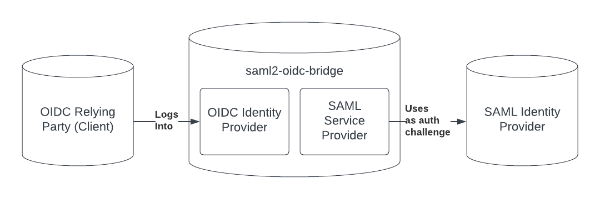

# Detailed Setup Tutorial

This tutorial details how the overall concepts of saml2-oic-bridge and a detailed explanation of how to set it up.

## Basic Concepts

### Intro

SAML2 and OIDC are two standards for third-party identity and authentication. If you've ever seen "Log in with Google" or "Log in with your company Id," there's a good chance that the log-in flow you're looking at is either SAML2 or OIDC.

Why do services use OIDC or SAML2? Oftentimes it doesn't make sense for users to have an identity for every single app, especially when those apps all function within an organization's ecosystem (imaging a university that has apps for scheduling classes and giving out grades. Sharing the same identity between those apps would be convenient). At the same time, for security reasons, it is bad practice to have the user provide an auth challenge (ie a password) directly to an app, so SAML and OIDC both have standards for redirecting a user away from the app to perform an auth challenge, then redirecting them back to the app.

OIDC and SAML2 perform relatively similar functions, but because they are different standards, an OIDC compatible client (app) cannot log in using a SAML identity provider. That's where `saml2-oidc-bridge` comes in.

### Key Terms

#### OIDC Terms
 - OIDC Relying Party: An OIDC Relying Party is an app that wants to authenticate using OIDC.
 - OIDC Identity Provider: An OIDC Identity Provider is a server that handles identity and authentication for a relying party.
 - Auth Challenge: An auth challenge is a method by which a user proves to the Identity Provider that they are who they claim to be. Traditionally this is through passwords, but it can also be through biometrics, key-pairs, 2FA, or other methods.

#### SAML2 Terms
 - SAML Service Provider: A SAML Service Provider is the name given to the client in the SAML world.
 - SAML Identity Provider: A SAML Identity Provider is a server that handles identities and authentication.

### What is the saml2-oidc-bridge?



The saml2-oidc-bridge is a server that sits allows OIDC-compatible relying parties to authenticate using SAML Identity Providers. From the perspective of the OIDC Relying Party, the saml2-oidc-bridge is an OIDC Identity Provider. From the perspective of the SAML Identity Provider, the saml2-oidc-bridge is a SAML Service Provider. Alltogether, we can say that the saml2-oidc-bridge is an OIDC Identity Provider that uses a SAML Idenitity Provider as an auth challenge.

## Setting up saml2-oidc-bridge

saml2-oidc-bridge can be deployed on any cloud server with access to the open internet. Note that there are many ways it can be deployed, but this is one way. We will use the following technologies:

 - [Ubuntu v22.04](https://ubuntu.com/): A server operating system that will run the bridge. You may use other operating systems as long as they are compatible with NodeJS.
 - [NodeJS](https://nodejs.org/en): A server-based implementation of JavaScript. saml2-oidc-bridge is writen with NodeJS. This is required.
 - [NPM](https://www.npmjs.com/): Node Package Manager, we will use this to install saml2-oidc-bridge. This is required.
 - [saml2-oidc-bridge](https://github.com/digitalcredentials/saml2-oidc-bridge): The library we will be installing. This is required.
 - [redis](https://redis.io/): A performant key-value store that will maintain state inside saml2-oidc-provider. At the moment you cannot
 - [NGINX](https://www.nginx.com/): A load balancer and proxy that will properly redirect incoming server requests to the client. This tutorial will configure a simple NGINX instance, but a more complicated load-balaning set-up will be needed for services expecting heavy traffic. Other proxies can be used as well.
 - [Let's Encrypt](https://letsencrypt.org/): A free Certificate Authority provided by EFF. This will ensure that all requests to this server are SSL secured (using HTTPS requests). It is possible to use other certificate authorities as well.

### 1. Provision your cloud server

Find your favorite cloud provider and provision a cloud server with Ubuntu v22.04. Provisioning servers will be different depending on the provider you use. Here are a few tutorials for some popular cloud hosts:

- [Digital Ocean](https://www.digitalocean.com/community/tutorials/initial-server-setup-with-ubuntu-22-04)
- [Amazon Web Services](https://docs.aws.amazon.com/AWSEC2/latest/UserGuide/EC2_GetStarted.html)
- [Google Cloud Platform](https://ubuntu.com/blog/launch-ubuntu-22-04-desktop-on-google-cloud)
- [Microsoft Azure](https://learn.microsoft.com/en-us/azure/virtual-machines/linux/create-upload-ubuntu)

### 2. Access your server
Once you've provisioned a server, ensure that you can access it via the command line. On unix based systems (Mac and Linux) you can use the ssh command. Let's assume that your user is named `myUser` and the IP of your server is 777.777.777.7777

```bash
ssh myUser@777.777.777.7777
```

If you're on a Windows machine, you can download and install [Putty](https://www.putty.org/).

### 3. Install NodeJS and NPM
You can install NodeJS by running the following commands:
```bash
sudo apt update
sudo apt install nodejs
```

### 4. Install NGINX
For a more in depth tutorial, you can follow [the official ubuntu nginx instructions](https://ubuntu.com/tutorials/install-and-configure-nginx#1-overview).

```bash
sudo apt update
sudo apt install nginx
```

### 4. Configure DNS
Let's assume you bought the domain name, `saml2-oidc-bridge.example` and you want to host the saml2-oidc-bridge at this domain. Log into your domain provider and look for a button that says "Manage DNS." Add the following domain name record. Then, create an "A Record" with "@" as the Host and your server's IP address as the value. For example, you can make:

```
A Record | @ | 777.777.777.777
```

It may take time for these records to update, but once they do, you should see the following when navigating to `http://saml2-oidc-bridge.example` in your web browser:


### 5. Configure NGINX

Now, we want to configure NGINX to direct incoming requests to the saml2-oidc-bridge. We can do this by updating the configuration. First access the configuration.

```bash
sudo vim /etc/nginx/sites-available/default
```

The following section uses `vim`, the command line based text editing tool. We'll walk you through some of the commands you'll need, but for more help, you can read the [vim tutorial](https://opensource.com/article/19/3/getting-started-vim).

You should now see some boilerplate configuration. We can delete all lines by typing `Esc + gg + dG`.

Now copy and paste the following configuration, and change the domain name:

```
server {
  server_name {{YOUR DOMAIN NAME for example: saml2-oidc-bridge.example}};
  location / {
    proxy_set_header Host $host;
    proxy_set_header X-Real-IP $remote_addr;
    proxy_set_header X-Forwarded-For $proxy_add_x_forwarded_for;
    proxy_set_header X-Forwarded-Proto $scheme;
    proxy_pass http://127.0.0.1:3000;
    proxy_redirect off;
  }
}
```

Note that `proxy_pass` points to `http://127.0.0.1:3000`. This is because, by default, the saml2-oidc-bridge runs on port 3000, but you'll need to update this if you decide to make it run on a different port.

Now, exit vim by typing `Esc + :wq + Enter`.

Next, we want to check if the configuration you've provided is valid. Run:
```bash
sudo nginx -t
```

If the configuration is valid, you'll see:

```bash
nginx: the configuration file /etc/nginx/nginx.conf syntax is ok
nginx: configuration file /etc/nginx/nginx.conf test is successful
```

Finally, we want to restart NGINX so all the changes can go into effect.

```bash
sudo systemctl restart nginx
```

### 6. Set up SSL with Let's Encrypt

Let's Encrypt's certbot automatically configures SSL certificates for you. To run certbot, [follow the instructions on their site](https://certbot.eff.org/instructions?ws=nginx&os=ubuntufocal).

### 7. Install saml2-oidc-bridge

```bash
npm install -g saml2-oidc-bridge
```

### 8. Install OpenSSL

```bash
sudo apt install openssl
```

### 9. Create a key pair for the SAML Service Provider
As a part of the SAML2 standard, the service provider (client) requires a key pair. We can generate the keypair using openSSL:

```bash
openssl req -newkey rsa:2048 -new -nodes -x509 -days 3650 -keyout saml-client-key.pem -out saml-client-cert.pem
```

This should generate two files. `saml-client-key.pem` (the private key) and `saml-client-cert.pem` (the public key).

### 10. Generate OIDC JWKS
As a part of the OIDC standard, the OIDC Identity Provider requires a JSON Web Key Set. This is simply a private key (like we generated in the last step), but in JSON form. You can [generate a JWKS online by following this link.](https://mkjwk.org/)

Create a new file by running `vim oidc-jwks.json` and pasting the value generated from the website. Then, type `Esc + :wq + Enter` to save and exit.

### 11. Get the Keys from the SAML Identity Provider
To connect to the SAML2 Identity Provider, we need information from the identity provider. Ask the system administrator for the SAML2 Identity Provider for its metadata file. Inside that file, you'll find the `<ds:X509Certificate>` tag. Copy the contents of this tag into a new file.

Do this for every SAML provider you want to support. In this example, let's say we want to support a SAML Identity Provider for the ACME organization. We'll save this to a file called `acme-saml-idp-key.crt`

### 12. Install and run Redis
Redis is a high-performance key value store. You can install redis by executing the following commands one at a time:

```bash
sudo apt install lsb-release
curl -fsSL https://packages.redis.io/gpg | sudo gpg --dearmor -o /usr/share/keyrings/redis-archive-keyring.gpg
echo "deb [signed-by=/usr/share/keyrings/redis-archive-keyring.gpg] https://packages.redis.io/deb $(lsb_release -cs) main" | sudo tee /etc/apt/sources.list.d/redis.list
sudo apt-get update
sudo apt-get install redis
```

### 13. Create a config file

Now we should have all the prerequisites to make the config. Recall, we have the following files:

 - `saml-client-key.pem`: A private key to represent saml2-oidc-bridge as a SAML Service Provider (client)
 - `./saml-client-cert.pem`: A public key to represent saml2-oidc-bridge as a SAML Service Provider (client)
 - `oidc-jwks.json`: A JWKS for the OIDC Identity Provider portion of the saml2-oidc-bridge.
 - `acme-saml-idp-key.crt`: The key for ACME's SAML Identity Provider

First, let's make a new JSON file. This file will hold the configurations for saml2-oidc-bridge.

```bash
vim config.json
```

Paste the following:

```json
{
  "baseUrl": "https://saml2-oidc-bridge.example",
  "port": "3000",
  "saml": {
    "privateKey": "./saml-client-key.pem",
    "cert": "./saml-client-cert.pem",
    "idps": [
      {
        "name": "acme",
        "displayName": "ACME",
        "sso_login_url": "https:/saml.acme.com/login",
        "sso_logout_url": "https://saml.acme.com/logout",
        "certificates": "acme-saml-idp-key.crt"
      },
    ]
  },
  "oidc": {
    "clients": [
      {
        "client_id": "oidc-debugger",
        "client_secret": "client-secret",
        "redirect_uris": [
          "https://oidcdebugger.com/debug"
        ],
        "allowedOrigins": [
          "https://oidcdebugger.com"
        ],
        "token_endpoint_auth_method": "none"
      }
    ],
    "cookieKeys": ["secret", "keys"],
    "jwks": "./oidc-jwks.json"
  },
  "redis": {
    "port": 6379,
    "host": "127.0.0.1",
    "prefix": "oidc:"
  }
}
```

Update the configuration for your needs:

- `baseUrl`: The URL you will deploy the bridge at
 - `port`: The port the server should listen at
 - `saml`: SAML configurations. The saml2-oidc-bridge is treated as a SAML client for IDPs
    - `saml.privateKey`: The private key generated in the previous step
    - `saml.cert`: The cert (public key) generated in the previous step
    - `idps`: A list of SAML IDPs this bridge should serve
       - `saml.idps[*].name`: A url-safe name for the idp. This will eventually be used to tell the saml2-oidc-bridge which idp it should try to login to.
       - `saml.idps[*].displayName`: A plain english name for the IDP. This will be used in a UI that lets the user select the IDP they want to login to.
       - `saml.idps[*].sso_login_url`: The login URL for the IDP. This can be found in the IDP metadata in the `location` field for the `SingleSignOnService` tag with a binding of `urn:oasis:names:tc:SAML:2.0:bindings:HTTP-Redirect`. (`<SingleSignOnService Binding="urn:oasis:names:tc:SAML:2.0:bindings:HTTP-Redirect" Location="https://example-saml-idp.com/login" />`)
       - `saml.idps[*].sso_logout_url`: The logout URL for the IDP. This can be found in the IDP metadata in the `location` field for the `SingleLogoutService` tag with a binding of `urn:oasis:names:tc:SAML:2.0:bindings:HTTP-Redirect`. (`<SingleLogoutService Binding="urn:oasis:names:tc:SAML:2.0:bindings:HTTP-Redirect" Location="https://example-saml-idp.com/logout" />`)
       - `saml.idps[*].certificates`: A list of certificates retrieved for the IDP metadata in the previous step.
 - `oidc`: OIDC configurations. The saml2-oidc-bridge is treated as an IDP for OIDC clients
    - `oidc.clients`: A list of all the clients that can authenticate with this IDP. For the most part, this follows [client configuration](https://github.com/panva/node-oidc-provider/blob/main/docs/README.md#clients) in node-oidc-provider.
       - `oidc.clients[*].client_id`: The client idp for the client
       - `oidc.clients[*].client_secret`: The client secret used in the client credentials flow
       - `oidc.clients[*].redirect_uris`: Valid redirect uris for the client
       - `oidc.clients[*].allowedOrigins`: Allowed origins for the client when making AJAX requests
       - `oidc.clients[*].token_enpoint_auth_method`: The autentication method for the `token` endpoint
    - `oidc.cookieKeys`: A list of randomized strings to be used for the session cookies
    - `jwks`: The route to the jwks generated in the previous step
 - `redis`: Configuration for the redis instance
    - `redis.port`: Redis port
    - `redis.host`: Redis host
    - `redis.prefix`: A prefix that will be used for all keys stored in the redis instance

### 14. Run the Server

We're ready for a test run of the server. To do this, we can execute the following command:

```bash
saml2-oidc-bridge start -c config.json
```

In the example configuration, we registered oidcdebugger.com as a relying party (client). We can use that to test the deployment. Go to [https://oidcdebugger.com](https://oidcdebugger.com) and set the following settings:

 -  Authorize URI: `https://{your domain}/auth` for example `https://saml2-oidc-bridge.example/auth`
 - Redirect URI: `https://oidcdebugger.com/debug`
 - Client Id: `oidc-debugger`
 - Scope: `openid profile`
 - Response Type: `code`
 - Use PKCE: `Yes`
 - Token URI: `https://{your domain}/token` for example `https://saml2-oidc-bridge.example/token`

If login works, you should be redirected back to oidcdebugger with a success message.

### 15. Set up the server for production

To get the server to run permanently, you can use `pm2`. To install pm2, run

```bash
npm install -g pm2
```

Now start the application:

```bash
pm2 start saml2-oidc-bridge -- -c config.json
```

If you run `pm2 list` you should now see your app running.

Finally, we want to ensure pm2 starts the saml2-oidc-bridge even if your ubuntu machine restarts.

```bash
pm2 startup
pm2 save
```